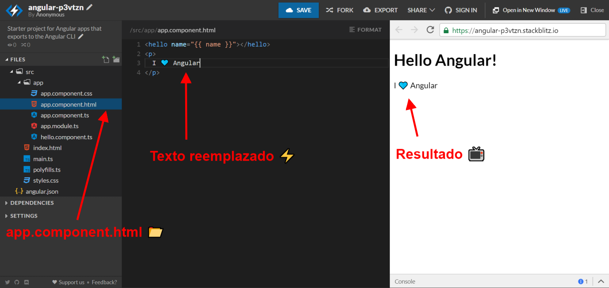

# 💃 Bienvenidas 💃

## Getting Super Powers

Becoming a super hero is a fairly straight forward process:

```
$ give me super-powers
```


 Super-powers are granted randomly so please submit an issue if you're not happy with yours.


Once you're strong enough, save the world:

```
// Ain't no code for that yet, sorry
echo 'You got to trust me on this, I saved the world'
```


\*\*\*\*[**Stackblitz**](https://stackblitz.com/) ****es una página web que te permite crear aplicaciones de Angular en el navegador. Eso quiere decir que no tienes que instalar nada más! 😎

### Paso \#1 📺

Entra a **www.stackblitz.com**, y verás algo como esto:




En Stackblitz puedes crear un proyecto de Angular, React o Ionic en segundos! ⏰


### Paso \#2 🅰

Selecciona **Angular,** y una vez se cree el proyecto verás algo como esto:


### Paso \#3 📂

En el panel de archivos y carpetas verás la carpeta `app`, esta carpeta es donde se encuentra nuestra aplicación. El resto de archivos son parte de la configuración de Angular. Algo por lo que no te debes preocupar aún 😉

Dentro de la carpeta `app`, vamos a buscar el archivo `app.component.html` , este archivo tiene el contenido de lo que estás viendo a la derecha. Si lo editas, automáticamente verás los resultados! ⚡️

Reemplaza: `Start editing to see some magic happen :)`, por `I 💙 Angular!`


## Lo lograste! 💪


Has completado el **desafío \#1**, ahora vamos a el **desafío \#2 👇**



